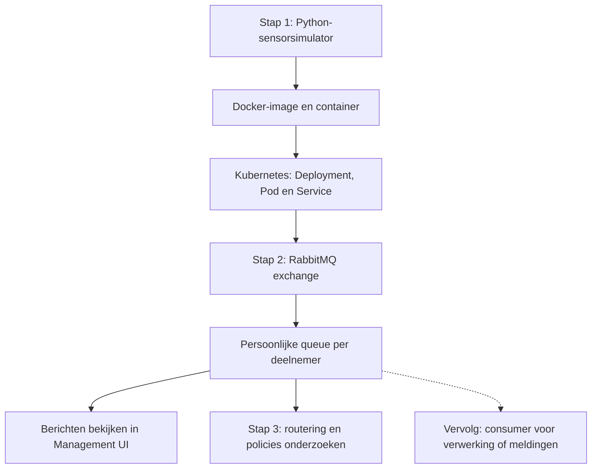

# Backendworkshop EOM

Hoe komt een realtime meting bij de juiste toepassing terecht? We beginnen met een kort praktijkvoorbeeld: een Jetson-camera en SAS ESP leveren detecties die via RabbitMQ verder verwerkt kunnen worden. Vervolgens bouwen we dezelfde basisroute met een Python-sensorsimulator.

Docker en Kubernetes vormen de ondergrond. RabbitMQ is het centrale workshoponderdeel: we richten routes in, volgen berichten en bekijken het resultaat in de RabbitMQ Management UI. Met frontend bedoelen we hier deze bestaande webinterface; we bouwen geen eigen frontend-applicatie.

## Workshoproute



| Stap | Wat doen we? | Wie voert uit? | Handleiding |
| --- | --- | --- | --- |
| 1 | Simulator uitleggen, image bouwen, container testen en deployen in Kubernetes | Begeleider demonstreert; deelnemers kijken mee | [stap-1.md](stap-1.md) |
| 2 | Eén broker deployen, eigen queues binden, handmatig testen en daarna simulator 2.0 verbinden | Begeleider deployt; deelnemers gebruiken de Management UI | [stap-2.md](stap-2.md) |
| 3 | Verkeerde routing key, TTL, max length, direct/topic/fanout en gekoppelde exchanges | Deelnemers oefenen; selectie afhankelijk van de tijd | [stap-3.md](stap-3.md) |

Elke stap eindigt met een checkpoint. De basisroute staat centraal. Voor ongeveer één uur kiest de begeleider een beperkt aantal experimenten; alle proeven blijven in de handleiding beschikbaar.

## Leerdoelen

Na de workshop kun je:

- uitleggen waarom we een applicatie verpakken als image en uitvoeren als container;
- de rollen van Pod, Deployment en Service onderscheiden;
- volgen hoe een producer via exchange, routing key en binding een queue bereikt;
- een eigen queue en binding maken en de ontvangen JSON bekijken;
- het resultaat van de uitgevoerde experimenten verklaren.

## Eén gedeelde omgeving, een eigen queue

Er zijn geen groepen. De begeleider beheert de simulator en de gedeelde broker. Iedere deelnemer gebruikt een unieke korte naam, bijvoorbeeld `wenjie2`, met alleen kleine letters en cijfers.

| Onderdeel | Afspraak |
| --- | --- |
| Kubernetes-namespace | `backend-workshop` |
| Simulator | Eén centrale Deployment `sensor-simulator` |
| RabbitMQ Deployment | `rabbitmq-deployment` |
| Virtual host | `/` |
| Gedeelde exchange | `sim_sensor_exchange`, type `direct` |
| Routing key | `sensor.data` |
| Eigen basisqueue | `sensor_queue_<naam>` |
| Experimentresources | Eigen namen volgens [stap-3.md](stap-3.md) |

Iedere correct gebonden persoonlijke queue krijgt een eigen kopie. Een eigen exchange maak je pas bij de experimenten met exchange-types. Verander de gedeelde basisexchange niet.

## Benodigdheden

**Deelnemers:** een browser, toegang tot de afgesproken workshopomgeving en de RabbitMQ Management UI. De begeleider deelt het UI-adres en de inloggegevens apart. Het deelnemerswerk gebeurt in de UI; lokaal Docker of kubectl installeren is daarvoor niet nodig.

**Begeleider:** een Bash-terminal met Docker, kubectl en curl, cluster- en registry-toegang, een voorbereide namespace, Secret `rabbitmq-credentials`, een werkende Ingress/DNS-route en rechten om RabbitMQ-policies te maken. De bestanden gebruiken `whu1/sensor-simulator` als workshopregistry; pas imageverwijzingen aan als je een ander account gebruikt.

De Ingress bevat `rabbitmq.workshop.example` als voorbeeldadres. Vervang dit vóór het deployen door het door de beheerder geregelde adres. De benodigde Ingress-controller en DNS moeten al beschikbaar zijn.

## Start

Lees de handleidingen direct op GitHub, download via **Code → Download ZIP**, of clone:

```bash
git clone https://github.com/whu2026/backend-workshop-eom.git
cd backend-workshop-eom
```

Bij een private repository heb je GitHub-toegang nodig. Deelnemers beginnen bij [stap-1.md](stap-1.md); de begeleider gebruikt daarnaast de bronbestanden in [stap-1](stap-1/) en [stap-2](stap-2/). De Bash-commando's voor het cluster voer je op de workshopmachine uit.

## Bestanden

| Locatie | Inhoud |
| --- | --- |
| `stap-1.md`, `stap-2.md`, `stap-3.md` | Handleidingen met opdrachten en controles |
| `stap-1/` | Simulator 1.0, Dockerfile, dependencies en Kubernetes-YAML |
| `stap-2/` | Simulator 2.0 en de RabbitMQ-configuratie |

## Voorbereiding en gebruik

- Bewaar wachtwoorden, tokens en ingevulde Secrets buiten GitHub. Log interactief in.
- De begeleider deployt RabbitMQ eenmaal vóór de oefeningen en maakt de gedeelde exchange vóór simulator 2.0 start.
- De workshopbroker heeft geen blijvende opslag. Herstart hem niet tijdens de oefeningen.
- Policies richten zich uitsluitend op jouw persoonlijke experimentqueue.
- Stap 1 en stap 2 bevatten de volledige code; de losse bestanden in dit pakket sluiten daarop aan.
