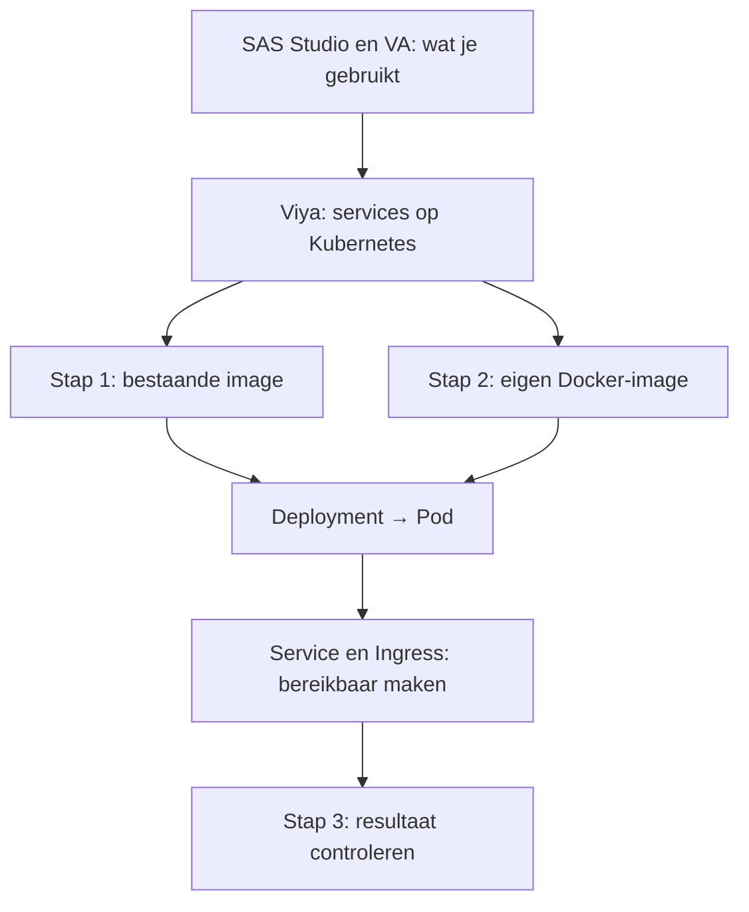

# Backendworkshop EOM — Kubernetes

**new-v1 · 60 minuten.** Na ETL in SAS Studio en rapporten in SAS Visual Analytics bekijken we hoe de applicaties achter die schermen draaien. We verbinden SAS 9 en het huidige SAS Viya-platform met Kubernetes. Daarna deploy je zelf een webserver en bouw je een kleine Python-app als containerimage.

## Wat je gaat leren

- Image, container, Pod, node en cluster uit elkaar houden.
- De rol van ConfigMap, Deployment, Service en Ingress uitleggen.
- Met een template een applicatie deployen en via een eigen hostname testen.
- Met `kubectl get`, `describe`, `logs` en `rollout status` controleren wat er gebeurt.
- Met Docker een eigen image bouwen, delen via een registry en uitvoeren in Kubernetes.

## Route en tijd

| Minuut | Onderdeel | Werkvorm |
|---|---|---|
| 0–8 | Frontend naar backend; SAS 9 en Viya; live Deployments en Pods bekijken | Uitleg en demo |
| 8–20 | Kubernetes: cluster, Deployment, Service, Ingress en ConfigMap | Uitleg met schema's |
| 20–34 | [Stap 1: bestaande image deployen](stap-1.md) | Zelf doen |
| 34–40 | Docker en images begrijpen | Uitleg |
| 40–54 | [Stap 2: eigen simulator bouwen en deployen](stap-2.md) | Zelf doen |
| 54–57 | [Stap 3: controleren en terugkijken](stap-3.md) | Samen |
| 57–59 | Korte RabbitMQ-demonstratie | Alleen begeleider |
| 59–60 | Afsluiting | Samen |



## Vooraf klaarzetten

De begeleider zorgt voor een werkende Kubernetes-context, namespace `backend-workshop`, Ingress-controller, DNS-hostnames, registry-toegang en `config/workshop.json`. Iedereen krijgt een **unieke naam**, bijvoorbeeld `a01`. Er zijn geen groepen. Alle oefeningen worden uitgevoerd in **Bash op de workshopserver**, niet in Windows CMD. Nodig op die server: `kubectl`, Docker, Python 3, `curl` en een editor.

Download de bestanden via GitHub → Code → Download ZIP, of:

```bash
git clone https://github.com/whu2026/backend-workshop-eom.git
cd backend-workshop-eom
```

Lees eventueel eerst [SAS 9 en Viya in het kort](SAS-9-EN-VIYA.md). Start daarna met [stap-1.md](stap-1.md). De werkmapgenerator geeft resources jouw naam. In je eigen nginx-map staan vier YAML-bestanden. Controleer je namen en labels, vul de image en hostname in en personaliseer de HTML in de ConfigMap. Pas labels, selectors en resource-namen niet los aan.

## Bestanden

- `stap-1/templates/`: templates voor de werkmapgenerator.
- `stap-1/nginx/`: vier gewone YAML-bestanden om handmatig aan te passen.
- `stap-2/simulator/`: Python-app, Dockerfile en buildcontext.
- `stap-2/templates/`: dezelfde Kubernetes-route voor de simulator.
- `oplossingen/`: volledig ingevulde voorbeelden en uitleg.
- [BEGELEIDER.md](BEGELEIDER.md): voorbereiding, live demo, timing en uitwijkroutes.
- [GITHUB-VERNIEUWEN.md](GITHUB-VERNIEUWEN.md): deze versie naar de bestaande repository zetten.
- [BRONNEN.md](BRONNEN.md): officiële achtergrondinformatie.

RabbitMQ is uitsluitend een kort, vooraf ingericht voorbeeld aan het einde. Er zijn geen RabbitMQ-opdrachten. SAS Viya wordt alleen bekeken; we installeren of wijzigen het niet tijdens de workshop.
