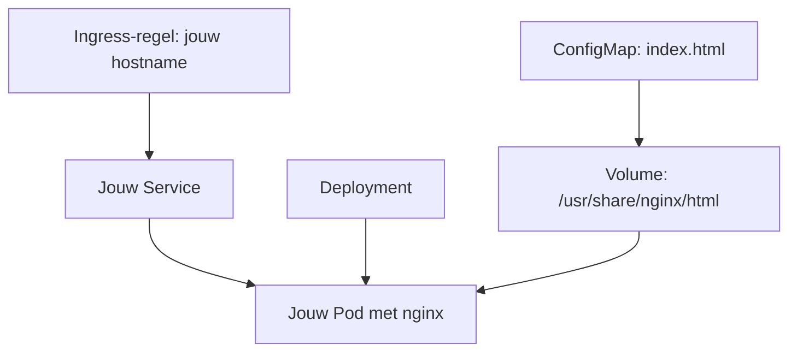

# Stap 1 — Je eigen nginx-pagina in Kubernetes

**Tijd: minuut 20–34. Doel: je eigen webpagina via je eigen hostname.**

We gebruiken allemaal namespace `backend-workshop`. Je werkt met vier bestanden in je eigen map `nginx`. De namen van de objecten én de labels zijn uniek per deelnemer.

| Bestand | Taak |
|---|---|
| `configmap.yaml` | Bevat jouw `index.html`. |
| `deployment.yaml` | Start nginx en koppelt de ConfigMap aan de container. |
| `service.yaml` | Selecteert jouw Pod via een label en biedt een interne naam. |
| `ingress.yaml` | Koppelt jouw hostname aan jouw Service. |



Het schema toont verwijzingen. De Ingress-controller voert de HTTP-routering uit. De Deployment beheert de Pod; hij is geen tussenstation in het HTTP-verkeer.

## 1. Eigen werkmap en namen — 2 minuten

Begin in de uitgepakte of geclonede repositorymap. Vervang `a01` door je toegewezen unieke naam. Gebruik kleine letters en eventueel cijfers/koppeltekens.

```bash
NAAM=a01
REPO=$(pwd)
python3 tools/maak_werkmap.py "$NAAM" --output "$HOME/workshop/$NAAM"
source "$HOME/workshop/$NAAM/workshop.env"
kubectl config current-context
kubectl -n backend-workshop get pods
```

De generator maakt alleen bestanden, geen clusterresources. Hij maakt onder jouw werkmap `nginx/`, `stap-2/` en `workshop.env`. De map `nginx` bevat alleen de vier YAML-bestanden. Bestaat je werkmap al, maak hem dan niet opnieuw maar laad de bestaande `workshop.env`. In iedere nieuwe terminal laad je die opnieuw.

**Verwacht:** je eigen werkmap en de juiste Kubernetes-context. `No resources found` kan normaal zijn; `Forbidden` betekent dat rechten ontbreken.

### Namen die overal moeten kloppen

De generator vult deze namen consequent in. Controleer ze zelf; bij handmatig aanpassen moet je alle verwijzingen meenemen.

| Onderdeel | Voorbeeld voor `a01` | Waar dezelfde waarde nodig is |
|---|---|---|
| ConfigMap | `nginx-demo-html-a01` | `metadata.name` én Deployment `volumes[].configMap.name` |
| Deployment | `nginx-demo-deployment-a01` | `metadata.name`; ook in je rollout/logs-commando's |
| App-label | `nginx-demo-a01` | Deployment `spec.selector.matchLabels.app`, Podtemplate `metadata.labels.app` én Service `spec.selector.app` |
| Service | `nginx-demo-service-a01` | `metadata.name` én Ingress `backend.service.name` |
| Ingress | `nginx-demo-ingress-a01` | `metadata.name` |
| Hostname | `nginx-web-a01.workshop.example.com` | Ingress `rules[].host`; bij TLS ook `tls.hosts` |
| Eigenaarlabel | `workshop-owner: a01` | Op alle vier objecten én de Podtemplate |
| Namespace | `backend-workshop` | Op alle vier objecten; ook de ConfigMap |

**Antwoord op “ook labels en selectors aanpassen?”:** ja. Gebruik per deelnemer een eigen `app`-waarde op alle drie genoemde plekken. Anders kan de Service verkeer naar Pods van iemand anders sturen.

**Bestandsnamen zijn vrij:** bijvoorbeeld `configmap-a01.yaml` mag. Kubernetes identificeert objecten aan objecttype, namespace en `metadata.name`, niet aan de lokale bestandsnaam. Bewaar niet twee versies van hetzelfde object in dezelfde apply-map.

## 2. De vier bestanden controleren en invullen — 3 minuten

```bash
cd "$WORK/nginx"
ls
printf 'Image: %s\nHost: %s\n' "$WEB_IMAGE" "$WEB_HOST"
nano configmap.yaml
nano deployment.yaml
nano service.yaml
nano ingress.yaml
```

- **ConfigMap:** controleer jouw naam en pas eventueel één HTML-zin aan. Laat `index.html: |` en de inspringing intact.
- **Deployment:** vervang `VUL_IMAGE_IN` door de getoonde, afgesproken image. Het pakket gebruikt standaard `nginx:stable-alpine`, zodat de interne `wget`-test beschikbaar is. Jouw eerdere `nginx:latest` kan ook met passende vooraf geteste controles; gebruik tijdens de workshop de image die de begeleider heeft getest.
- **Service:** controleer jouw `app`-selector. `port: 80` is de Servicepoort; `targetPort: http` verwijst naar de benoemde containerpoort `http`, hier 80.
- **Ingress:** vervang iedere `VUL_HOST_IN` door de toegewezen hostname, zonder `http://`, `https://` of pad. De IngressClass is vooraf ingevuld. Een host in YAML maakt geen DNS-record.

Bewaren in nano: Ctrl+O, Enter, Ctrl+X. Gebruik spaties, geen tabs.

### Hoe komt de HTML in nginx?

Deze fragmenten staan al in de Deployment; vergelijk de namen met de ConfigMap:

```yaml
# Onder de nginx-container:
volumeMounts:
  - name: html-volume
    mountPath: /usr/share/nginx/html
    readOnly: true

# Onder spec.template.spec:
volumes:
  - name: html-volume
    configMap:
      name: nginx-demo-html-a01
```

De sleutel `index.html` in de ConfigMap verschijnt als bestand `/usr/share/nginx/html/index.html`. De mount bedekt hier de standaard HTML-map van nginx. Je ziet daarom je eigen pagina. Hiervoor hoef je de image niet te bouwen. ConfigMaps zijn voor niet-geheime tekst/configuratie.

| YAML-veld | Betekenis |
|---|---|
| `apiVersion`, `kind` | Welke API en welk objecttype. |
| `metadata` | Naam, namespace en labels. |
| `spec` | Gewenste configuratie. |
| `replicas: 1` | Eén gewenste Pod. |
| `template` | Beschrijving van de Pods. |
| `readinessProbe` | Controle of de app klaar is voor verkeer. |
| `resources` | CPU/geheugenaanvraag en limieten. |

## 3. Alles samen deployen — 3 minuten

Controleer met `pwd` dat je in **jouw nginx-map** staat. Daar horen alleen jouw vier YAML-bestanden te staan.

```bash
pwd
kubectl -n backend-workshop apply -f .
kubectl -n "$NS" rollout status deployment/"$WEB" --timeout=90s
kubectl -n "$NS" get deployments,pods,configmaps -l workshop-owner="$NAAM"
kubectl -n "$NS" get pods -l app="$WEB_APP" -o wide
kubectl -n "$NS" logs deployment/"$WEB" --tail=10
```

**Verwacht:** vier objecten `created` of `configured`; daarna een uitgerolde Deployment en een Pod met `1/1 Running`. Een Pod kan tijdens het aanmaken kort wachten op de ConfigMap/image. Blijft dat zo, bekijk events met `kubectl -n "$NS" describe pods -l app="$WEB_APP"`.

**Checkpoint 1:** wijs jouw eigen Pod aan en bevestig dat deze Ready is. `apply` toont dat de configuratie is geaccepteerd; de rollout en HTTP-test controleren de uitvoering.

## 4. Interne Service testen — 2 minuten

```bash
kubectl -n "$NS" get service "$WEB_SERVICE"
kubectl -n "$NS" get endpointslices -l kubernetes.io/service-name="$WEB_SERVICE"
kubectl -n "$NS" exec deployment/"$WEB" -- wget -qO- "http://$WEB_SERVICE/"
```

**Verwacht:** een interne Service en een passend endpoint. De HTTP-uitvoer bevat `Backend Workshop`, `Mijn eerste Kubernetes Deployment!` en jouw naam. Geen standaard `Welcome to nginx!` meer.

De test draait in de afgesproken nginx Alpine-container, waarin `wget` aanwezig is. Je laptop hoeft de ClusterIP niet rechtstreeks te kunnen bereiken. Zie je een verkeerde pagina? Controleer de ConfigMap-verwijzing en mount. Zie je een andere deelnemersnaam? Controleer eerst labels en selectors.

**Vraag:** maakt de Service de Pod aan? **Antwoord:** nee. De Deployment laat Pods beheren; de Service routeert verkeer naar passende endpoints.

## 5. Eigen hostname openen — 3 minuten

De Ingress is al toegepast met `apply -f .`.

```bash
kubectl -n "$NS" get ingress "$WEB_INGRESS"
curl --fail --show-error --max-time 10 "$SCHEME://$WEB_HOST/"
printf 'Open in de browser: %s://%s/\n' "$SCHEME" "$WEB_HOST"
```

**Verwacht:** je eigen pagina met je naam. De controller, IngressClass en DNS zijn vooraf geregeld door de begeleider. Een lege `ADDRESS`-kolom is op zichzelf niet doorslaggevend; test de URL.

**Checkpoint 2:** toon de pagina en leg de route uit: browser → Ingress-controller → jouw Service → jouw Pod met nginx. De HTML komt uit jouw ConfigMap.

### Extra, alleen als je eerder klaar bent

Wijzig één HTML-zin in `configmap.yaml` en pas het bestand opnieuw toe:

```bash
kubectl -n "$NS" apply -f configmap.yaml
```

Een als volume gekoppelde ConfigMap wordt uiteindelijk bijgewerkt; dit hoeft niet direct te zijn. Wacht even en ververs de browser zonder cache. Een ConfigMap-update start op zichzelf geen Deployment-rollout. Wil je tijdens de oefening voorspelbaar een nieuwe Pod met de actuele inhoud, voer dan uit:

```bash
kubectl -n "$NS" rollout restart deployment/"$WEB"
kubectl -n "$NS" rollout status deployment/"$WEB" --timeout=90s
```

Bij één replica kan een onderbreking optreden. Pas uitsluitend jouw eigen Deployment aan. We gebruiken geen `subPath`-mount.

## 6. Stap 1 klaar — 1 minuut

Je hebt een image gedeployed, eigen HTML aangeboden en Service plus Ingress getest. Ga terug naar de repositorymap voor de Docker-bestanden:

```bash
cd "$REPO"
```

Ga naar [stap 2](stap-2.md). Volledige YAML en antwoorden staan bij [oplossingen](oplossingen/README.md). De vier templatebestanden staan in [stap-1/templates](stap-1/templates).

## Alternatief: jouw vier bestanden handmatig aanpassen

Werk je liever zoals in de demo, zonder werkmapgenerator? Gebruik dan de vier gewone YAML-bestanden in [stap-1/nginx](stap-1/nginx). Ze bevatten voorbeeldnamen met `jouwnaam` en een fictief domein. Je hoeft geen templatesyntax of generator-instellingen te bewerken.

1. Kopieer de map `stap-1/nginx` naar je eigen workshopmap. Bij een gedeeld account gebruikt iedereen een eigen bovenliggende map.
2. Vervang **overal** `jouwnaam` door je toegewezen naam: in objectnamen, ConfigMap-verwijzing, labels, selectors, Serviceverwijzing en de zichtbare HTML.
3. Zet de echte toegewezen hostname en bestaande IngressClass in `ingress.yaml`. Voeg eventuele TLS-instellingen toe volgens de vooraf gegeven workshopconfiguratie.
4. Controleer de image in `deployment.yaml` en alle namen met de tabel hierboven. Beide routes gebruiken dezelfde vier Kubernetes-objecten.
5. Open een terminal in jouw map `nginx` en voer uit:

```bash
kubectl -n backend-workshop apply -f .
# Hieronder is a01 een voorbeeld: vervang dit door jouw eigen naam.
kubectl -n backend-workshop rollout status deployment/nginx-demo-deployment-a01 --timeout=90s
kubectl -n backend-workshop get pods -l app=nginx-demo-a01
kubectl -n backend-workshop get service nginx-demo-service-a01
kubectl -n backend-workshop get ingress nginx-demo-ingress-a01
```

Deze handmatige route gebruikt geen `workshop.env`. Voor stap 2 laat je de begeleider de variabelen uit de hoofdroute voorbereiden met **dezelfde deelnemersnaam**, of gebruik je rechtstreeks jouw namen in de commando's. Pas de gegenereerde nginx-bestanden niet opnieuw toe over je handmatige werk. Gebruik één route per oefening.
