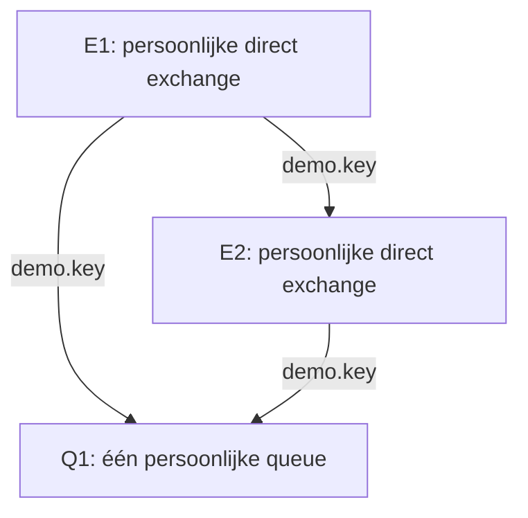

# Stap 3 — RabbitMQ-experimenten

[Terug naar de workshop](README.md) · [Stap 2](stap-2.md)

## Doel en route

De keten werkt: de simulator publiceert naar `sim_sensor_exchange` en jouw queue ontvangt sensordata. Nu onderzoeken we wat er verandert als we een binding, policy of exchange-type wijzigen. Voorspel eerst de uitkomst, voer de proef uit en open daarna het antwoord.

| Experiment | Onderwerp | Richttijd |
| --- | --- | --- |
| 1 | Verkeerde routing key | 3 minuten |
| Vooraf | Queue-policies uitleggen | 3 minuten |
| 2 | Message TTL | 4 minuten |
| 3 | Max length | 4 minuten |
| 4 | Direct exchange | 2 minuten |
| 5 | Topic exchange | 2 minuten |
| 6 | Fanout exchange | 2 minuten |
| 7 | Exchange → exchange → queue | 4 minuten |

Dit zijn indicatieve tijden zodra iedereen in de UI zit. De begeleider kiest welke proeven binnen de beschikbare tijd passen. De overige proeven kun je later uitvoeren, zolang de workshopomgeving beschikbaar is.

## Voorbereiding

- Open de RabbitMQ Management UI via het adres van de begeleider. Selecteer virtual host `/`.
- De simulator draait met één replica en publiceert ongeveer iedere seconde met routing key `sensor.data` naar de gedeelde **direct** exchange `sim_sensor_exchange`.
- Jouw basisqueue `sensor_queue_<naam>` ontvangt berichten. Laat deze als referentie bestaan.
- Kies een unieke naam met alleen kleine letters en cijfers, bijvoorbeeld `wenjie2`. Vervang **overal** `<naam>` door die naam, ook in policy-patronen. Typ de hoekhaken niet mee.
- Gebruik steeds nieuwe, lege experimentqueues zonder actieve consumers en zonder extra queue-argumenten. Bij herhaling kun je een nieuwe naam kiezen. Purge uitsluitend je eigen experimentqueue als je die bewust leeg wilt maken.
- Voor policies zijn voldoende rechten nodig. Ontbreekt **Admin → Policies** of krijg je een autorisatiefout, laat de begeleider jouw policy maken.

Alle experimentqueues: **Type Classic**, **Durability Durable**, **Auto delete No**, **Arguments leeg**. Alle persoonlijke exchanges: **Durability Durable**, **Auto delete No**, **Internal No**, **Arguments leeg**. Kies het type dat bij de proef staat. De workshopbroker heeft geen blijvende opslag: herstart de broker niet tijdens het oefenen.

### De drie UI-handelingen die je steeds gebruikt

1. **Queue maken:** Queues and Streams → Add a new queue → naam en instellingen invullen → Add queue.
2. **Binding maken:** open de queue → Bindings → Add binding to this queue → From exchange en Routing key invullen → Bind. Controleer de nieuwe binding.
3. **Bericht publiceren:** Exchanges → jouw bronexchange → Publish message → Routing key en Payload invullen → één keer Publish message. Vul geen expiration in bij deze proeven.

`Ready` telt berichten die nog klaarstaan. `Unacked` telt al geleverde maar nog niet bevestigde berichten. Wacht bij tellingen op een UI-verversing. Tijdens een meting gebruik je **Get messages** nog niet: daarmee verander je mogelijk de voorraad. Als je later de payload bekijkt, kies bewust requeue (terugplaatsen) of zonder requeue (verwijderen).

## Experiment 1 — Verkeerde routing key

**Voorspel:** de simulator gebruikt `sensor.data`. Wat gebeurt er als jouw binding `sensor.wrong` is?

### Doe dit

1. Maak `exp-routing-queue-<naam>`.
2. Bind deze aan `sim_sensor_exchange` met key `sensor.wrong`.
3. Wacht ongeveer tien seconden en vergelijk met je basisqueue.
4. Verwijder op de experimentqueue alleen de binding met `sensor.wrong`.
5. Voeg een binding naar dezelfde exchange toe met `sensor.data`.
6. Wacht op nieuwe berichten en bekijk één payload.

**Verwacht:** eerst blijft de experimentqueue leeg terwijl de basisqueue groeit. Na herstel komen nieuwe sensormetingen binnen. De berichten van vóór het herstel verschijnen niet alsnog in deze queue.

Antwoord en verklaring

Een direct exchange vergelijkt de routing key exact met de binding key. `sensor.wrong` en `sensor.data` zijn verschillend. Een werkende verbinding bewijst dus nog niet dat jouw route klopt. Een exchange bewaart geen geschiedenis voor een queue die pas later een passende binding krijgt.

**Klaar:** je kunt uitleggen waarom de eerste route niets opleverde. Verwijder daarna alleen de binding van deze experimentqueue, zodat die niet blijft groeien.

## Eerst begrijpen — Queue-policies

Een policy past instellingen toe op queues met een passende naam. Er zijn meerdere mogelijkheden; **we proberen bewust alleen message TTL en max length**. Zo vergelijken we tijd en aantal afzonderlijk.

| Policy-optie | Betekenis | Vandaag |
| --- | --- | --- |
| `message-ttl` | Maximale verblijftijd van berichten in een queue, in milliseconden | Experiment 2 |
| `max-length` | Maximum aantal Ready-berichten | Experiment 3 |
| `max-length-bytes` | Maximum gezamenlijke payloadomvang van Ready-berichten | Alleen noemen |
| `expires` | Een ongebruikte queue na een periode laten vervallen | Alleen noemen |
| `overflow` | Gedrag wanneer een lengtelimiet wordt bereikt | Alleen noemen; standaardgedrag gebruiken |
| `dead-letter-exchange` | Bepaalde uitgevallen berichten naar een andere exchange sturen | Alleen noemen |

Een extra `dead-letter-routing-key` kan de key voor dead-lettering bepalen. Niet iedere optie geldt voor ieder queue-type. We gebruiken classic queues. Message TTL laat berichten vervallen; `expires` kan juist de **queue zelf** verwijderen. Zie de officiële uitleg over [TTL](https://www.rabbitmq.com/docs/ttl), [lengtelimieten](https://www.rabbitmq.com/docs/maxlength) en [dead-lettering](https://www.rabbitmq.com/docs/dlx).

### Policy invoeren

Open **Admin → Policies → Add / update a policy**. Selecteer vhost `/` en gebruik de tabel bij het experiment. Zet **Apply to** op **Queues** en **Priority** op `0`. Bij Definition voeg je een key en waarde toe; kies het waardetype **Number**. Policy-keys hebben hier geen `x-` ervoor.

Een patroon zoals `^exp-ttl-queue-wenjie2$` selecteert precies die naam. Gebruik geen breed patroon zoals `.*`. Controleer op de queuepagina of jouw policy zichtbaar is voordat je de binding toevoegt. Als er andere policies, operatorregels of queue-argumenten gelden, laat de begeleider die controleren: die kunnen de uitkomst beïnvloeden. We testen op aparte queues zonder zulke extra instellingen. Zie [RabbitMQ Policies](https://www.rabbitmq.com/docs/policies).

## Experiment 2 — Message TTL: vijf seconden

**Voorspel:** blijft de queue groeien als de simulator blijft publiceren, maar berichten slechts vijf seconden bewaard mogen worden?

### Doe dit

1. Maak `exp-ttl-queue-<naam>`, nog zonder binding.
2. Maak deze policy en controleer dat hij actief is op de queue:

| Veld | Waarde |
| --- | --- |
| Name | `ttl-policy-<naam>` |
| Pattern | `^exp-ttl-queue-<naam>$` |
| Apply to | Queues |
| Priority | `0` |
| Definition key | `message-ttl` |
| Definition value / type | `5000` / Number |

3. Bind de queue aan `sim_sensor_exchange` met `sensor.data`.
4. Observeer ongeveer vijftien seconden zonder berichten op te halen.
5. Verwijder alleen deze binding. De simulator en basisqueue blijven werken.
6. Wacht langer dan vijf seconden en laat de UI verversen.

**Verwacht:** bij continue instroom blijft Ready rond enkele berichten schommelen. Nadat je de binding verwijdert, komen geen nieuwe berichten bij en loopt de queue leeg zodra de resterende berichten verlopen en de UI is bijgewerkt.

Antwoord en verklaring

`5000` milliseconden is vijf seconden. Iedere meting heeft haar eigen aankomsttijd. Nieuwe berichten komen binnen terwijl oudere verlopen. Een verlopen bericht wordt niet meer geleverd. Door publicatietiming en UI-verversing hoeft Ready niet exact vijf te zijn. Het verlopen van de kopie in deze queue verwijdert de kopie in je basisqueue niet.

**Klaar:** de queue kan zonder ophalen leeglopen door TTL. Verwijder na de proef je eigen `ttl-policy-<naam>`; de binding is al verwijderd. De queue zelf blijft bestaan.

## Experiment 3 — Max length: vijf Ready-berichten

**Voorspel:** wat gebeurt er met het oudste bericht wanneer een zesde bericht binnenkomt?

### Doe dit

1. Maak `exp-maxlen-queue-<naam>`, nog zonder binding.
2. Maak deze policy en controleer dat hij actief is:

| Veld | Waarde |
| --- | --- |
| Name | `maxlen-policy-<naam>` |
| Pattern | `^exp-maxlen-queue-<naam>$` |
| Apply to | Queues |
| Priority | `0` |
| Definition key | `max-length` |
| Definition value / type | `5` / Number |

3. Bind de queue aan `sim_sensor_exchange` met `sensor.data`.
4. Wacht ongeveer tien seconden. Gebruik geen Get messages tijdens het tellen.
5. Verwijder de binding om de instroom te stoppen. Laat de UI verversen en noteer Ready.
6. Bekijk de overgebleven berichten met Get messages, maximaal vijf, zonder requeue. Vergelijk hun `sequence` met de eerste berichten uit de proef.

**Verwacht:** de queue bewaart maximaal vijf Ready-berichten. Bij standaard overflow `drop-head` blijven de meest recent ontvangen berichten over. Zonder nieuwe instroom en zonder TTL blijven ze wachten tot je ze ophaalt.

Antwoord en verklaring

Bij `drop-head` maakt het oudste Ready-bericht plaats voor een nieuw bericht zodra de limiet wordt overschreden. Vijf berichten is geen termijn van vijf seconden. De limiet telt Ready, niet Unacked. Een andere overflowinstelling, zoals het weigeren van nieuwe berichten, zou een andere uitkomst geven; die stellen we nu niet in.

**Klaar:** je kunt het verschil tussen TTL en max length uitleggen. Verwijder je eigen `maxlen-policy-<naam>` na de proef.

## Experiment 4 — Direct exchange

**Voorspel:** welke van twee keys matcht binding `sensor.data`?

### Doe dit

1. Maak exchange `exp-direct-<naam>` met type **direct**.
2. Maak queue `exp-direct-queue-<naam>`.
3. Bind deze queue aan jouw direct exchange met `sensor.data`.
4. Publiceer op jouw exchange ieder testbericht precies eenmaal:

| Routing key | Payload | Verwachte toename Ready |
| --- | --- | --- |
| `sensor.data` | `{"test":"direct-data"}` | +1 |
| `sensor.alert` | `{"test":"direct-alert"}` | +0 |

**Verwacht:** vanaf een lege queue staat Ready op `1`. Get messages toont `direct-data`.

Antwoord en verklaring

Direct gebruikt een exacte overeenkomst. Alleen `sensor.data` matcht de binding. De JSON-inhoud wordt niet gebruikt voor deze routingbeslissing.

**Klaar:** direct is getest. Gebruik voor de volgende proef nieuwe resources; wijzig het type van de gedeelde exchange niet.

## Experiment 5 — Topic exchange

**Voorspel:** hoeveel woorden matcht de ster in `sensor.*`?

### Doe dit

1. Maak exchange `exp-topic-<naam>` met type **topic**.
2. Maak queue `exp-topic-queue-<naam>` en bind met `sensor.*`.
3. Publiceer ieder bericht eenmaal op jouw topic exchange:

| Routing key | Payload | Verwachte toename Ready |
| --- | --- | --- |
| `sensor.data` | `{"test":"topic-data"}` | +1 |
| `sensor.alert` | `{"test":"topic-alert"}` | +1 |
| `system.data` | `{"test":"topic-system"}` | +0 |
| `sensor.room.data` | `{"test":"topic-room"}` | +0 |

**Verwacht:** Ready is `2` voordat je berichten ophaalt. Alleen `topic-data` en `topic-alert` zijn aanwezig.

Antwoord en verklaring

Topic vergelijkt woorden gescheiden door punten. `*` matcht precies één woord; `#` matcht nul of meer woorden. `sensor.room.data` heeft na `sensor` twee woorden en past daarom niet op `sensor.*`. Met `sensor.#` zou die key wel matchen. Die uitbreiding hoef je voor deze proef niet uit te voeren.

**Klaar:** je kunt uitleggen waarom `sensor.room.data` ontbreekt. Zie de [topic-tutorial](https://www.rabbitmq.com/tutorials/tutorial-five-python).

## Experiment 6 — Fanout exchange

**Voorspel:** kunnen twee verschillende queues dezelfde publicatie ontvangen, ongeacht de key?

### Doe dit

1. Maak exchange `exp-fanout-<naam>` met type **fanout**.
2. Maak twee queues: `exp-fanout-q1-<naam>` en `exp-fanout-q2-<naam>`.
3. Bind beide aan jouw fanout exchange. Laat de binding key leeg.
4. Publiceer precies één bericht naar de fanout exchange: key `een.willekeurige.key`, payload `{"test":"fanout-een"}`.
5. Controleer beide queues vóór je berichten ophaalt. Bekijk daarna de payload in elke queue.

**Verwacht:** beide queues hebben één kopie. Een bericht zonder requeue ophalen uit Q1 verwijdert de kopie in Q2 niet.

Antwoord en verklaring

Fanout routeert naar alle gebonden queues en negeert de routing key. Dit zijn twee afzonderlijke queues, elk met een eigen kopie. Twee consumers van één queue zouden de berichten doorgaans verdelen; dat is een andere opstelling.

**Klaar:** direct, topic en fanout zijn vergeleken. Zie de [fanout-tutorial](https://www.rabbitmq.com/tutorials/tutorial-three-python).

## Experiment 7 — Twee routes naar dezelfde queue

**Voorspel:** krijgt Q1 één of twee kopieën als één publicatie langs twee geldige routes dezelfde queue bereikt?

### Doe dit

1. Maak twee **direct** exchanges: `exp-e1-<naam>` en `exp-e2-<naam>`.
2. Maak één lege queue `exp-e2e-q1-<naam>`.
3. Open de **bronexchange E1** → Bindings → Add binding from this exchange. Kies destination type **Exchange**, destination `exp-e2-<naam>` en routing key `demo.key`. Klik Bind. Controleer de richting **E1 → E2**.
4. Open Q1 → Add binding to this queue. Bind vanuit `exp-e1-<naam>` met `demo.key`.
5. Bind op dezelfde Q1 ook vanuit `exp-e2-<naam>` met `demo.key`.
6. Controleer deze drie bindings:

| Bron | Doeltype | Doel | Key |
| --- | --- | --- | --- |
| `exp-e1-<naam>` | Exchange | `exp-e2-<naam>` | `demo.key` |
| `exp-e1-<naam>` | Queue | `exp-e2e-q1-<naam>` | `demo.key` |
| `exp-e2-<naam>` | Queue | `exp-e2e-q1-<naam>` | `demo.key` |

7. Controleer Q1: Ready `0`, geen actieve consumer.
8. Publiceer **precies één keer naar E1** met key `demo.key` en payload `{"test":"e2e-een"}`.
9. Wacht op UI-verversing en controleer Q1. Bekijk daarna de payload.

**Verwacht:** Q1 heeft precies één bericht, ondanks de twee routes.

Antwoord en verklaring

RabbitMQ routeert deze ene publicatie maar eenmaal naar dezelfde doelqueue, ook wanneer meerdere bindingspaden die queue bereiken. Twee losse publicaties blijven twee berichten. Ook herlevering na bijvoorbeeld een verbroken consumerverbinding is iets anders. Deze proef toont dus geen algemene garantie van precies-eenmaalverwerking. Zie [Exchange-to-exchange bindings](https://www.rabbitmq.com/docs/e2e).

**Klaar:** je kunt het verschil uitleggen tussen twee routes en twee publicaties.

## Als het resultaat afwijkt

| Signaal | Controle |
| --- | --- |
| Alle queues blijven leeg | Controleer met de begeleider of simulator 2.0 publiceert en vhost `/` juist is. |
| Alleen jouw queue blijft leeg | Controleer spelling, richting en type van de binding; publiceer na herstel opnieuw. |
| Policy verschijnt niet | Controleer exacte queuenaam, patroon, vhost, Apply to en rechten. |
| TTL of max length werkt anders | Controleer bestaande queue-argumenten, andere policies, numeriek waardetype en actieve consumers. |
| Ready verandert onverwacht | Wacht op UI-verversing; controleer instroom, Get messages, requeue en andere publishers. |
| E2E levert twee berichten | Controleer of je tweemaal publiceerde of de queue al een bericht bevatte. Begin opnieuw met alleen je eigen lege testqueue. |

## Opruimen en afronden

Verwijder alleen je eigen experimentresources: de twee persoonlijke policies, de queues met jouw `exp-…-<naam>` en de exchanges met jouw `exp-…-<naam>`. Verwijder geen gedeelde exchange, broker of basisqueue. Laat de basisqueue beschikbaar tot de gezamenlijke afsluiting.

Stap 3 is voor de gekozen proeven klaar zodra je kunt vertellen **wat je wijzigde, wat je zag en waarom**. De route blijft dezelfde: de producer maakt een bericht, de exchange kiest de route, de queue bewaart en een consumer verwerkt.
